## Measuring and suppressing sequencer errors in next generation sequencing

!!!note
**To manuscript reviewers:** to ensure anonymous review, we have asked the editor to send you accounts so that you do not need to create your own account to keep your test run anonymous. Please contact the editor if you do not receive the account information.
!!!

|                       |                                                                                                                                                                                                                                                    |
| --------------------- | -------------------------------------------------------------------------------------------------------------------------------------------------------------------------------------------------------------------------------------------------- |
| **Authors**           | Eric M Davis, Yu Sun, Yanling Liu, Pandurang Kolekar, Ying Shao, Karol Szlachta, Heather L Mulder, Dongren Ren, Stephen V Rice, Zhaoming Wang, Joy Nakitandwe, Alex Gout, Leslie L Robison, Stanley Pounds, Jefferey Klco, John Easton, Xiaotu Ma* |
| **Publication**       | [SequencErr: measuring and suppressing sequencer errors in next-generation sequencing data](https://genomebiology.biomedcentral.com/articles/10.1186/s13059-020-02254-2)                                                                                                                                                                                                                                       |
| **Technical Support** | [Contact Us](https://stjude.cloud/contact)                                                                                                                                                                                                         |

## Overview

There is currently no method to precisely measure the errors that occur in the sequencing instrument, which is critical for next generation sequencing applications aimed at discovering the genetic makeup of heterogeneous cellular populations. 
We propose a novel computational method, SequencErr, to address this challenge by measuring base concordance in overlapping region between forward and reverse reads. Analysis of 3,777 public datasets from 75 research institutions in 18 countries revealed the sequencer error rate to be ~10 per million (pm) and 1.4% of sequencers and 2.7% of flow cells have error rates >100 pm. At the flow cell level, error rates are elevated in the bottom surfaces and >90% of HiSeq and NovaSeq flow cells have at least one outlier error-prone tiles. 
By sequencing a common DNA library on different sequencers, we demonstrate that sequencers with high error rates have reduced overall sequencing accuracy, and that removal of outlier error-prone tiles improves sequencing accuracy. Our study revealed novel insights into the nature DNA sequencing errors incurred in sequencers. Our method can be used to assess, calibrate, and monitor sequencer accuracy, and to computationally suppress sequencer errors in existing datasets

## Inputs

| Name           | Type       | Description                                     | Example          |
| -------------- | ---------- | ----------------------------------------------- | ---------------- |
| BAM file       | Input file | Binary version of the SAM file format (`*.bam`) | Sample.bam       |
| BAM index file | Input file | Index file for the BAM file (`*.bai`)           | Sample.bam.bai   |

## Outputs

| Name           | Format | Description                                       |
| -------------- | ------ | ------------------------------------------------- |
| PairError file | `.txt` | Base concordance/discordance counts               |
| Counts file    | `.txt` | Base call frequencies for each genomic coordinate |

## Details of SequencErr Input Files and Parameters

1. **BAM file name** _[Required]_

    A BAM file to process. 
    
    * This app currently only supports DNA sequencing.
    * The bam file should be generated by “bwa aln”. It works on “bwa MEM” but may take a lot more resources.
    
    !!!example Notes on preparing the BAM file
    -   Read names must have all the 7 fields as described below,
    -   **\[instrument]:\[run number]:\[flowcell ID]:\[lane]:\[tile]:\[x-pos]:\[y-pos]**
    -   Example: **A041:30:HHTYVDSXX:1:2242:28366:18897**
    -   BAM format details [here](http://samtools.github.io/hts-specs/SAMv1.pdf)
    -   See [this page](https://help.basespace.illumina.com/articles/descriptive/fastq-files/) for details of the fields in readname 
    !!!

2. **BAM index file name** _[Required]_

    The BAM index for your BAM file

3. **sample id** _[Required]_

    A unique name or identifier for the sample

4. **trimming length** _[optional]_

    Number of bases to trim off the 5' and 3' of the read.
    Default: 5

5. **hard quality cutoff** _[optional]_

    A hard threshold for discarding reads. If the fraction of bases with quality scores falling below this value exceeds fcut, the read will be filtered.
    Default: 20

6. **don't report base counts** _[optional]_
    
    Set this to prevent large count files from being generated
    Default: true

## Running the Analysis

!!!note
This tool is intended free-of-charge for non-profit usages. 
Please contact [Dr. Xiaotu Ma](mailto:Xiaotu.Ma@stjude.org) for for-profit usages and modifications
!!!

Please refer to the following steps to learn how to launch the workflow, hook up input files, adjust parameters, run analysis and inspect output files.

**Log in and Launch the SequencErr**

**SequencErr** application can be accessed from [https://platform.stjude.cloud/workflows/sequencerr](https://platform.stjude.cloud/workflows/sequencerr)

!!!warning For Manuscript Reviewers only
Please select **_DNAnexus account_** option to log in.
    
Follow the stepwise instructions available in the **PDF [here](./SequencErr_Instructions.pdf)** .
!!!

General users please refer to the following instructions.

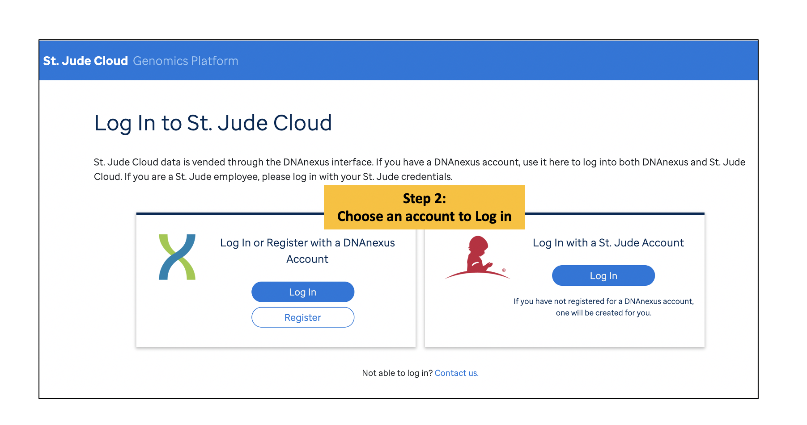

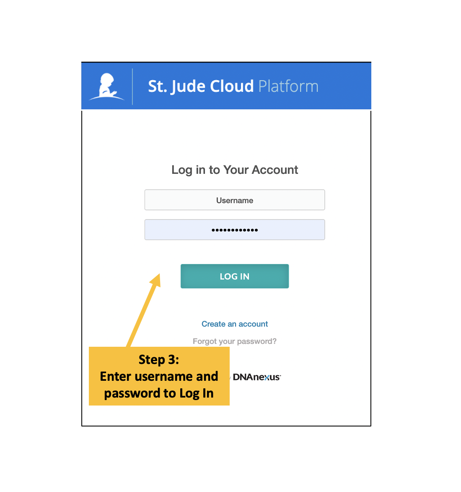

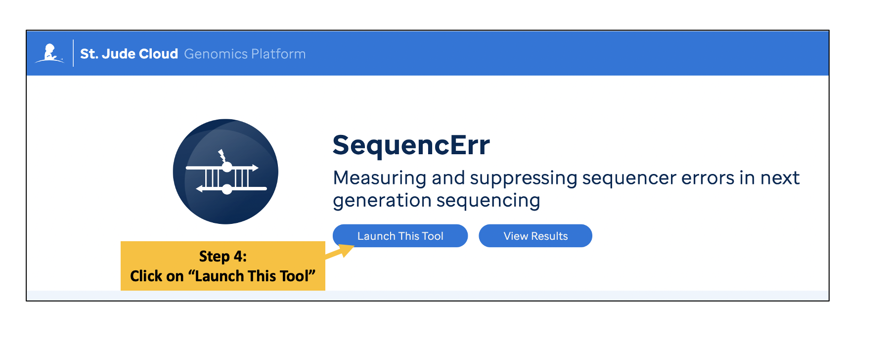

**Choose Input BAM and Index Files**

Users can upload and download data files with **command line interactions** as described [here](../../analyzing-data/command-line)

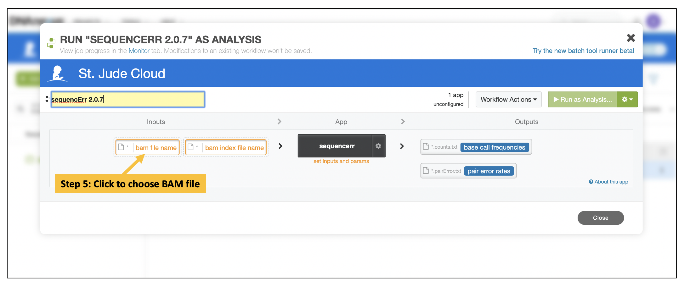

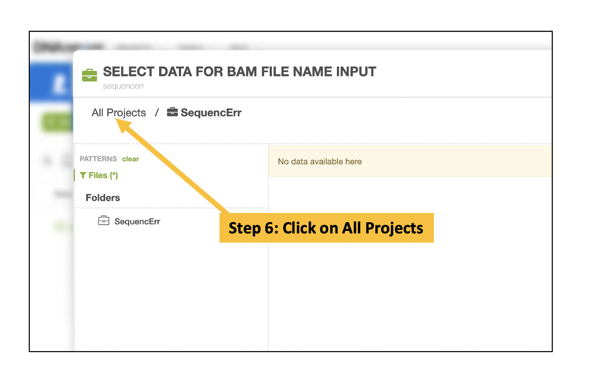

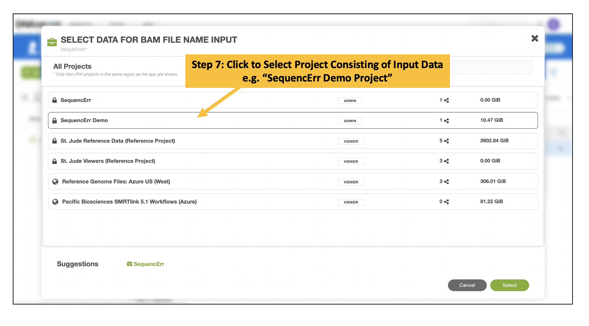

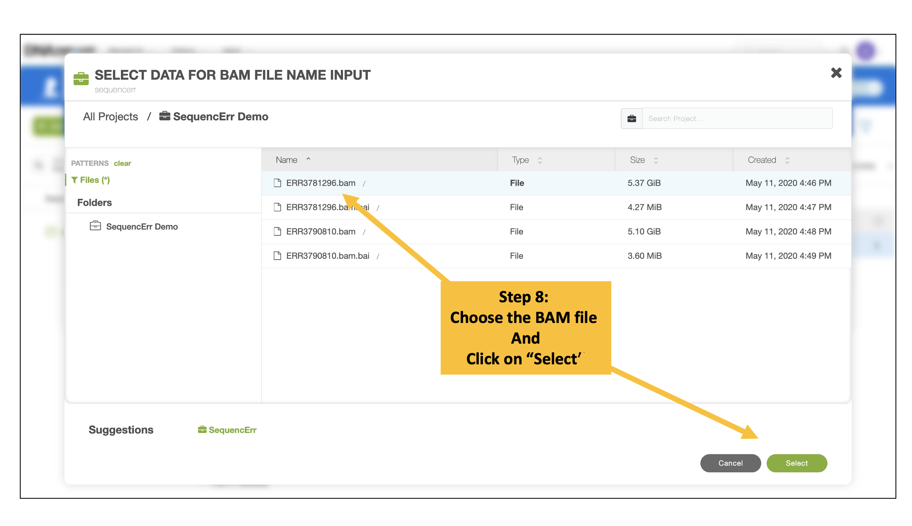

Follow the similar steps to choose and select the corresponding BAM index file

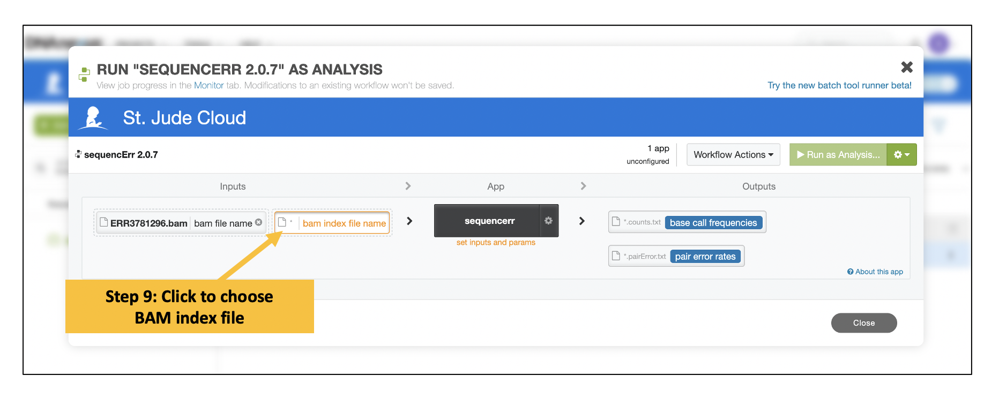

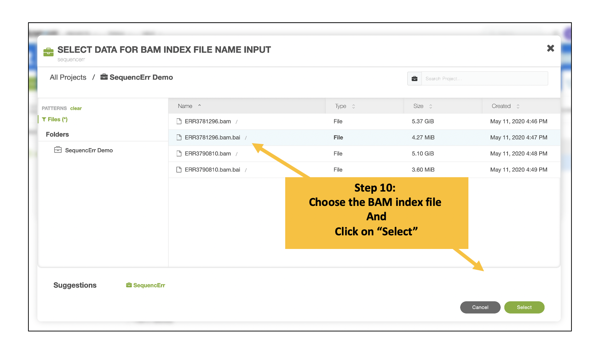

**Provide Input Parameters**

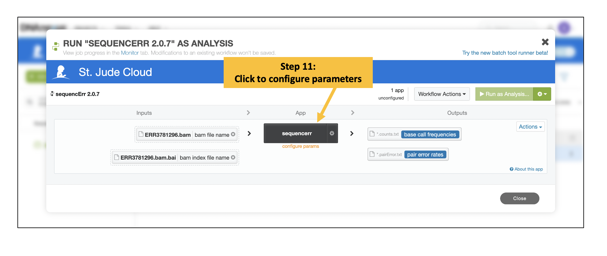

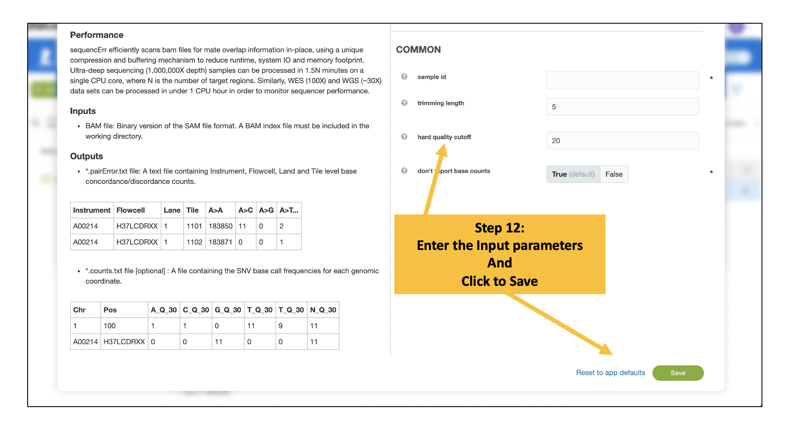

**Run the Analysis**

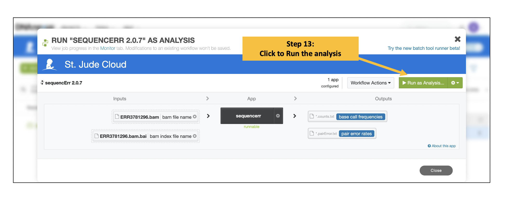

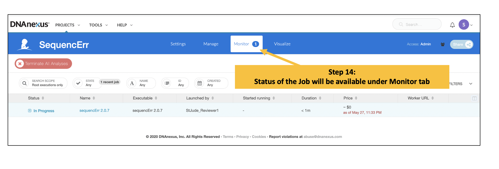

**Locate Output File(s) after Completion of the Analysis**

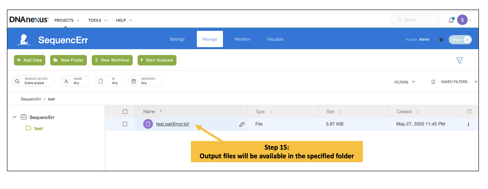

## Interpreting results

* **\*.pairError.txt** file: A text file containing Instrument, Flowcell, Lane and Tile level base concordance/discordance counts

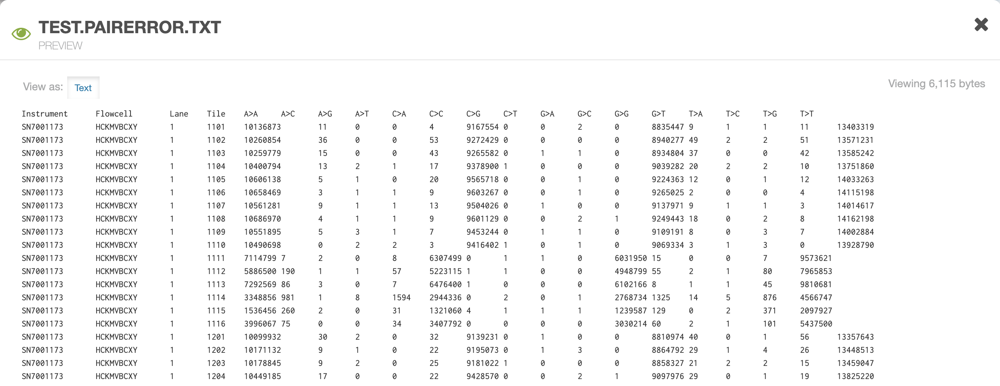

* **\*.counts.txt** file [optional] : A text file containing the base call frequencies and coverage for each genomic coordinate at specified base quality cut-off

## Similar Topics

[Running our Workflows](../../analyzing-data/running-sj-workflows)  
[Working with our Data Overview](../../managing-data/working-with-our-data)   
[Upload/Download Data (local)](../../managing-data/upload-local)    
