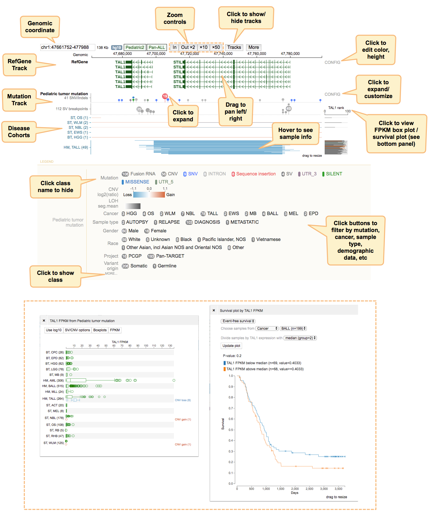
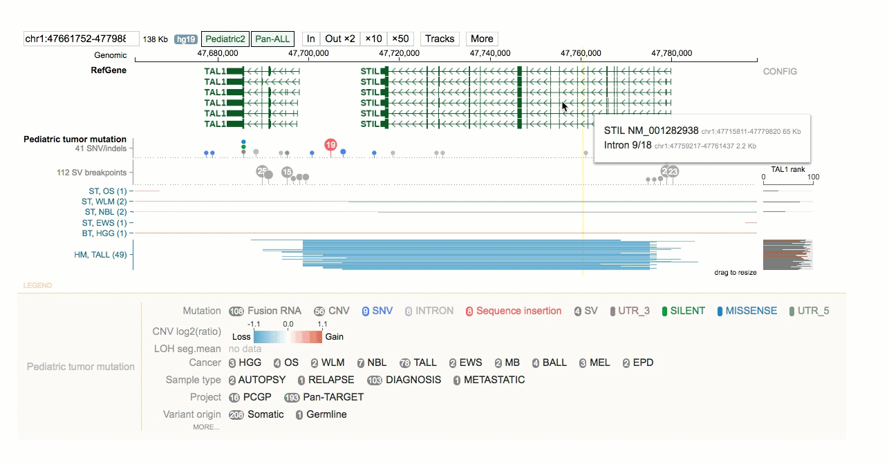
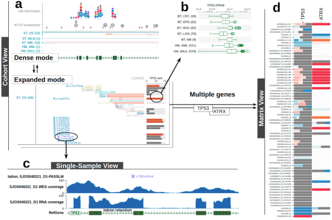
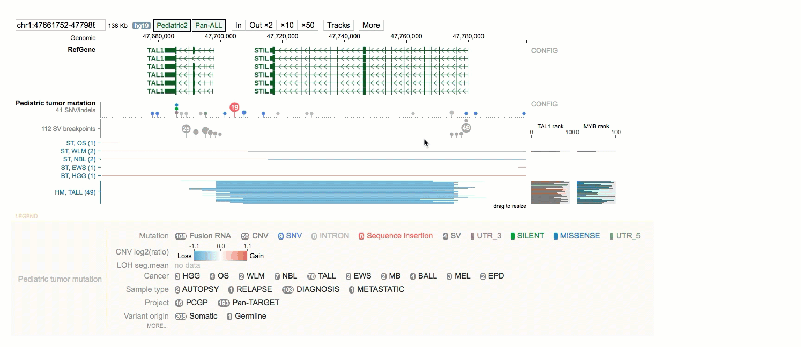
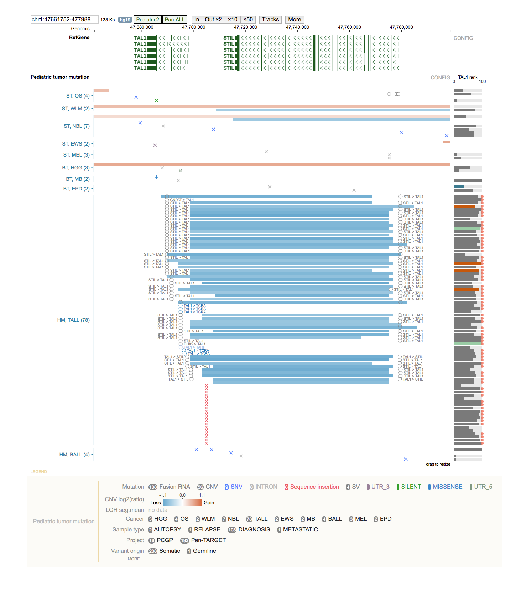
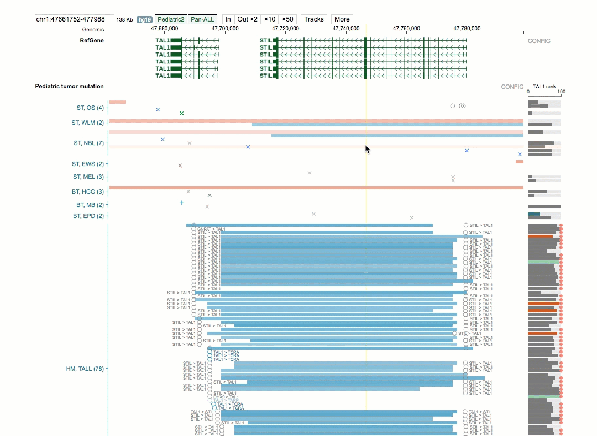
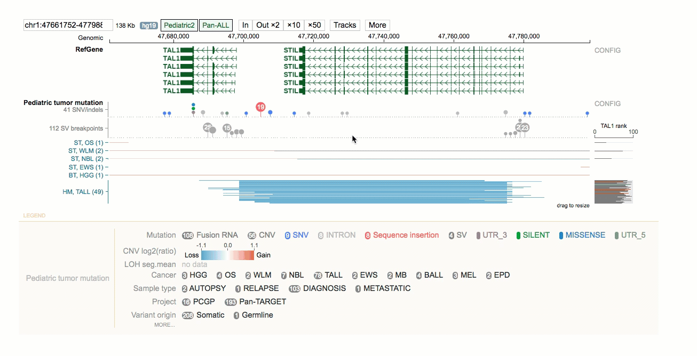

# GenomePaint

[GenomePaint](https://genomepaint.stjude.cloud/) is a visualization browser for simultaneously viewing genomic, transcriptomic, and epigenomic pediatric cancer mutation datasets across a multitude of disease cohorts. GenomePaint datasets include WGS, WES, RNA-Seq, SNP-chip, ChIP-Seq, and Hi-C data visualized over the hg19 reference genome. You can use GenomePaint to interpret the impact of somatic coding and noncoding alterations from ~3,800 pediatric tumors, make novel discoveries through visual exploration, and create publication ready figures!

## Getting Started

The GenomePaint browser homepage lands on a dense cohort view of the TAL1 gene region of chromosome 1. Each section of the display can be interacted with by clicking, dragging, or hovering. Filter the information displayed on the tracks by clicking buttons in the legend. Customize the legend display by hiding/showing classes. Click **CONFIG** to the right of tracks for additional display customization.

To navigate tracks,

* Pan left or right by clicking on the middle part of the track and dragging
* Zoom in by dragging the genomic coordinate ruler on top or zoom in 1 fold by clicking on the **IN** button
* Zoom out by *x* fold by clicking on an **OUT** button.

You can even zoom in to display mutations at bp resolution. 

GenomePaint offers three different views: cohort view, sample view, and matrix view. The figure below summarizes how each view is connected.

## Cohort View
The cohort view shows mutations from all samples over a genomic region, along with the gene expression ranks for each of the samples. By default the mutation track displays the cohort view in dense mode, a compact display showing density plots for SVs and SNV/indels. You can toggle the view to expanded mode by clicking the **CONFIG** button to the right of the mutation track and then clicking Expanded.

In Expanded mode (see below) all types of mutations are shown for each sample, one row per sample. Circles represent SV/fusion breakpoints, and x marks represent SNV/indels, each of which are displayed together with CNV/LOH. SNV/indels and breakpoints are always shown on top of CNV and LOH. Text labels can be shown for SV/fusion/SNV/indel, if available.

## Sample View
The sample view shows mutations for one sample alone, along with any available genomic assay tracks. You can open a sample view from the expanded cohort view by clicking on any type of single mutation within the sample, and then selecting *Focus*. This brings up a new browser view showing data tracks from this sample in the region surrounding the mutation.

On the sample view you can explore expression rank, tumor mutations, structural variants, splice junctions, WES coverage, and RNA-Seq coverage. Customize the display by zooming in/out, hiding and/or rearranging tracks, or editing **CONFIG** options.

## Matrix View
The matrix view combines the mutation profiles of multiple genomic regions in one view, in the form of a sample-by-region matrix. Such a matrix can be generated for samples from one cancer type. To open a matrix view, select a disease cohort from the cohort view and then select Matrix view. This organizes the selected cohort tumors with mutations in the genomic region you are viewing into a single-column matrix.

Next, go back to the cohort view and type another gene or region of interest into the genome coordinate box and press ENTER. The cohort view will now show data at the new genomic location. Click on the same disease cohort and then select Matrix view.

This will add the new genomic variant as a second column in the matrix. You can continue adding columns to this matrix in the same manner.

## Advanced Customizations

There are several more advanced customizations you can leverage with GenomePaint such as creating custom tracks, importing your own data, and embedding interactive visualizations on your web page. For instructions on these topics, please see our [detailed tutorial](https://docs.google.com/document/d/1owXUQuqw5hBHFERm0Ria7anKtpyoPBaZY_MCiXXf5wE/edit). Please excuse the different location and formatting as we work to incorporate this into our main documentation pages.
