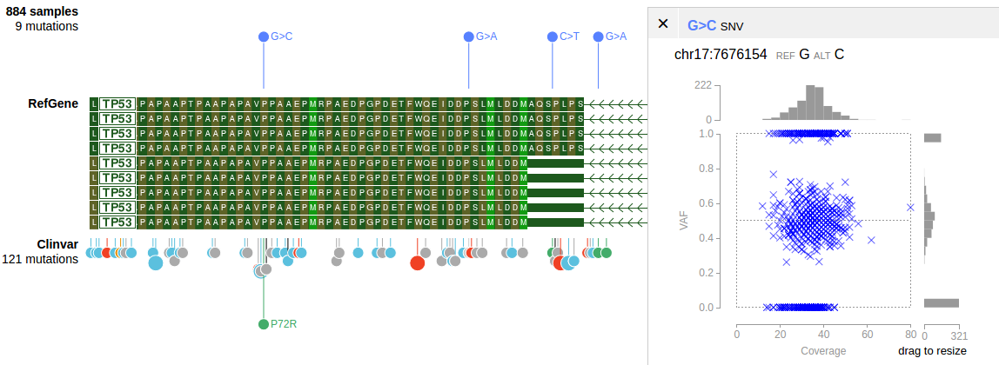
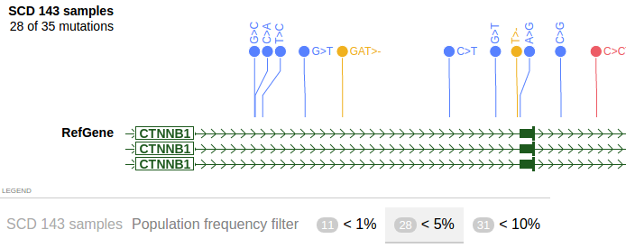
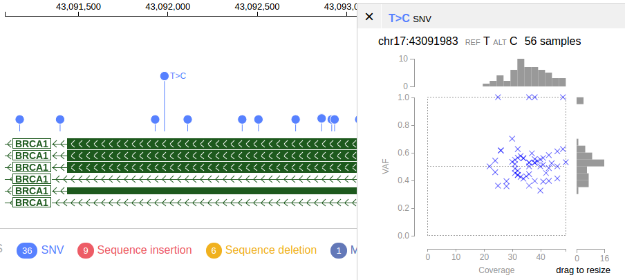
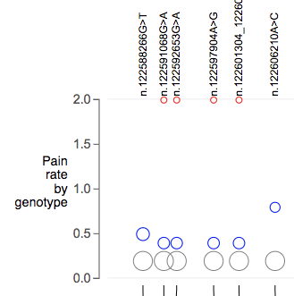
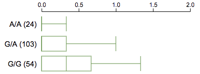
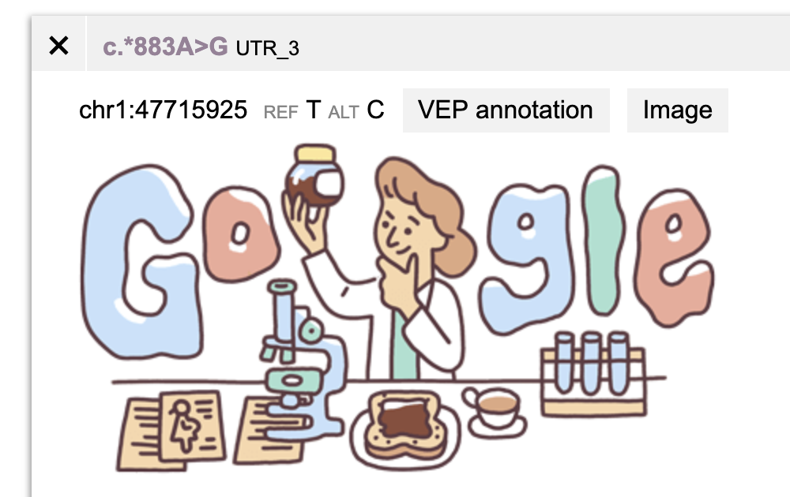
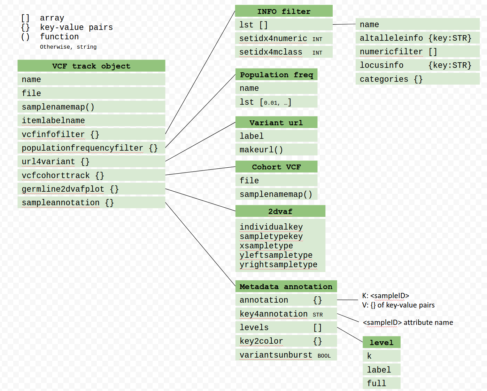

**Using VCF file on ProteinPaint**

Current implementation works for SNV/indel data only.



## Preparing a VCF file

Input file: file.vcf

```bash
bgzip file.vcf
tabix -p vcf file.vcf.gz
```

If successful, this will produce two files "file.vcf.gz" and
"file.vcf.gz.tbi". The latter is the TBI index file. CSI index also
works.

## Hosting a VCF file

Host it on the ProteinPaint server:

1. Put both the .gz file and the index file at the same directory
    > inside the <TP> directory of the ProteinPaint server.

    a.  The <TP> directory is specified in the file "serverconfig.json".

2. Obtain the relative path to the .gz file from but not include the <TP> directory.

    a.  E.g. for <TP>/path/to/file.vcf.gz, the path would be "path/to/file.vcf.gz"

Host it on a web server:

1. Put the .gz and index files on the web server. Obtain the URL of the .gz file for submission. For most cases ProteinPaint expects to find the index file at the same location of the .gz file

2. If the index file does not share URL with the .gz file, provide its URL via the .indexURL attribute in the JSON definition

## Showing a VCF file on ProteinPaint

### Via URL parameters

Examples:

```
http://server?block=on&genome=[genome]&vcffile=[name],[file path]
http://server?block=on&genome=[genome]&vcfurl=[name],[file URL]
```

The "vcfurl" cannot accept a separate URL for the index file, for such
case, use embedding API instead

This will launch a genome browser view showing the VCF track.

### Via embedding API

If the index file is using a separate URL with the .gz file, the
embedding API must be used, in which the attribute "indexURL" can be
used to provide an additional URL for the index file.

[General introduction of embedding API.](https://docs.google.com/document/d/1KNx4pVCKd4wgoHI4pjknBRTLrzYp6AL_D-j6MjcQSvQ/edit?usp=sharing)

[General introduction on JSON definition for tracks.](https://docs.google.com/document/d/1ZnPZKSSajWyNISSLELMozKxrZHQbdxQkkkQFnxw6zTs/edit?usp=sharing)

See section **Summary of VCF track object** for an overview of the VCF
track object.

## Variant annotation formats

This section describes supported formats for functional annotation of
variants. The annotation is optional and mostly for coding variants. The
annotation will color-code variants using ProteinPaint's built-in
protein mutation classes.

Shortcoming is the built-in classes are hardcoded and cannot be
customized.

ProteinPaint fully supports custom defined classes through an
alternative method. See the section on highlighting and filtering with
INFO fields.

### VEP format

The VCF output from the VEP is accepted by ProteinPaint. Find details at
[http://useast.ensembl.org/info/docs/tools/vep/vep_formats.html](http://useast.ensembl.org/info/docs/tools/vep/vep_formats.html)
at the "VCF output" section.

The annotation is encoded in an INFO field called CSQ. It supports
functional annotation of multiple isoforms on a given allele.

Description of the CSQ sub-fields must be in a required format for the
purpose of identifying the name and order of the sub-fields. Following
is one example:

```
##INFO=<ID=CSQ,Number=.,Type=String,Description="Consequence type as predicted by VEP. Format: Allele|Gene|Feature|Feature_type|Consequence|cDNA_position|CDS_position|Protein_position|Amino_acids|Codons|Existing_variation|ALLELE_NUM|DISTANCE|STRAND|SYMBOL|SYMBOL_SOURCE|HGNC_ID|BIOTYPE|CANONICAL|CCDS|ENSP|SWISSPROT|TREMBL|UNIPARC|SIFT|PolyPhen|EXON|INTRON|DOMAINS|HGVSc|HGVSp|GMAF|AFR_MAF|AMR_MAF|ASN_MAF|EUR_MAF|AA_MAF|EA_MAF|CLIN_SIG|SOMATIC|PUBMED|MOTIF_NAME|MOTIF_POS|HIGH_INF_POS|MOTIF_SCORE_CHANGE|LoF_info|LoF_flags|LoF_filter|LoF">
```

Required CSQ sub-fields:

-   Feature_type

    -   When the value of Feature_type is "Transcript" for a variant, the value of "Feature" should be isoform name, e.g. RefSeq or ENSEMBL isoform. If multiple isoform names joined by comma, the first will be used

-   Consequence

    -   The VEP consequence notation [http://useast.ensembl.org/info/genome/variation/predicted_data.html](http://useast.ensembl.org/info/genome/variation/predicted_data.html) is converted to internal notation used by ProteinPaint. A match table is shown below

-   HGVSp

-   Protein_position

-   Amino_acids

-   HGVSc

-   Existing_variation

    -   If any above fields are available, will use the value as the label of the variant

| **VEP notation**                       | **ProteinPaint notation** | **Note**                  |
| -------------------------------------- | ------------------------- | ------------------------- |
| transcript_ablation                   | deletion, intragenic      | Not yet supported.        |
| splice_acceptor_variant              | splice                    |                           |
| splice_donor_variant                 | splice                    |                           |
| stop_gained                           | nonsense                  |                           |
| frameshift_variant                    | frameshift                |                           |
| stop_lost                             | nonsense                  |                           |
| start_lost                            | nonsense                  |                           |
| transcript_amplification              | nonstandard               | Not yet supported.        |
| inframe_insertion                     | proteinins                |                           |
| inframe_deletion                      | proteindel                |                           |
| missense_variant                      | missense                  |
| protein_altering_variant             | nonsense                  | Not explicitly supported  |
| splice_region_variant                | splice_region            |                           |
| incomplete_terminal_codon_variant   | nonsense                  |                           |
| stop_retained_variant                | silent                    | Not explicitly supported. |
| synonymous_variant                    | silent                    |                           |
| coding_sequence_variant              | nonstandard               | Not explicitly supported. |
| mature_miRNA_variant                 | exon                      | Not yet supported.        |
| 5_prime_UTR_variant                 | utr_5                    |                           |
| 3_prime_UTR_variant                 | utr_3                    |                           |
| non_coding_transcript_exon_variant | exon                      |                           |
| intron_variant                        | intron                    |                           |
| NMD_transcript_variant               | silent                    | Not equivalent.           |
| non_coding_transcript_variant       | exon                      |                           |
| upstream_gene_variant                | noncoding                 | Not explicitly supported. |
| downstream_gene_variant              | noncoding                 | Not explicitly supported. |
| TFBS_ablation                         | noncoding                 | Not yet supported.        |
| TFBS_amplification                    | noncoding                 | Not yet supported.        |
| TF_binding_site_variant             | noncoding                 | Not yet supported.        |
| regulatory_region_ablation           | noncoding                 | Not yet supported.        |
| regulatory_region_amplification      | noncoding                 | Not yet supported.        |
| feature_elongation                    | noncoding                 | Not yet supported.        |
| regulatory_region_variant            | noncoding                 | Not yet supported.        |
| feature_truncation                    | noncoding                 | Not yet supported.        |
| intergenic_variant                    | noncoding                 | Not yet supported.        |

### ANN format

As generated by SnpEff:
[http://snpeff.sourceforge.net/VCFannotationformat_v1.0.pdf](http://snpeff.sourceforge.net/VCFannotationformat_v1.0.pdf)

This format uses the "ANN" INFO field. The meta line:
```
##INFO=<ID=ANN,Number=.,Type=String,Description="Functional annotations: 'Allele | Annotation | Annotation_Impact | Gene_Name | Gene_ID | Feature_Type | Feature_ID | Transcript_BioType | Rank | HGVS.c | HGVS.p | cDNA.pos / cDNA.length | CDS.pos / CDS.length | AA.pos / AA.length | Distance | ERRORS / WARNINGS / INFO' ">
```

Example annotation data:

```
ANN=T|5_prime_UTR_variant|MODIFIER|TUBB8|TUBB8|transcript|XM_011519459.2|protein_coding|1/4|c.-177G>A|||||750|,T|upstream_gene_variant|MODIFIER|TUBB8|TUBB8|transcript|NM_177987.2|protein_coding||c.-187G>A|||||187|,T|upstream_gene_variant|MODIFIER|TUBB8|TUBB8|transcript|XM_011519460.2|protein_coding||c.-1248G>A|||||961|,T|upstream_gene_variant|MODIFIER|TUBB8|TUBB8|transcript|XM_017016193.1|protein_coding||c.-1370G>A|||||967|,T|upstream_gene_variant|MODIFIER|TUBB8|TUBB8|transcript|XM_017016192.1|protein_coding||c.-1370G>A|||||955|
```

The "Annotation" notations are converted to the built-in mutation class
using the same set of VEP rules.

### In-house format

This format uses multiple INFO fields to provide per-alt allele values:

```
##INFO=<ID=AV_POS,Number=A,Type=Integer,Description="Annovar+: adjusted allele position in order of ALT column">
##INFO=<ID=AV_REF,Number=A,Type=String,Description="Annovar+: adjusted reference allele in order of ALT column">
##INFO=<ID=AV_ALT,Number=A,Type=String,Description="Annovar+: adjusted variant allele in order of ALT column">
##INFO=<ID=AV_ACC,Number=A,Type=String,Description="Annovar+: isoform accession in order of ALT column">
##INFO=<ID=AV_AA,Number=A,Type=String,Description="Annovar+: amino acid change in order of ALT column">
##INFO=<ID=AV_CLASS,Number=A,Type=String,Description="Annovar+: variant class in order of ALT column">
```

Example annotation:

```
AV_POS=69655;AV_REF=G;AV_ALT=C;AV_ACC=NM_001005484;AV_AA=D189H;AV_CLASS=missense
```

## Combining multiple VCF files in one track

This is only achievable by declaring the tracks in JSON and calling
ProteinPaint's [embedding API](https://docs.google.com/document/d/1KNx4pVCKd4wgoHI4pjknBRTLrzYp6AL_D-j6MjcQSvQ/edit?usp=sharing).

Following example shows the JSON part of a VCF track which combines
multiple VCF files.

```javascript
{
"type":"vcf",
"name":"track name",
"tracks":[
    {
      "file":"path/to/sample1.gz"
    },  
    {   
       "file":"path/to/sample2.gz"
    },  
    ... more files ...
]
}
```

In above example, the "tracks" attribute provides a list of member
tracks.

Each member track can have 0 or multiple samples.

## Highlighting and filtering variants with INFO fields

Variants from a VCF track can be highlighted by other types of
annotation, in addition to the default mutation class.


To recreate this display, save following text into an HTML file, and
display it in a web browser.

```html
<!DOCTYPE html>
<html>
<head><meta charset="utf-8"></head>
<body>
<script src="https://proteinpaint.stjude.org/bin/proteinpaint.js" charset="utf-8"></script>
<div id=aaa style="margin:10px"></div>
<script>
runproteinpaint({
    host:'https://proteinpaint.stjude.org',
    holder:document.getElementById('aaa'),
    parseurl:true,
    block:true,
    genome:'hg38',
    position:'chr12:25245155-25246060',
    nativetracks:'RefGene',
    tracks:[   {
        type:'vcf',
        name:'Clinvar',
        file:'hg38/clinvar.hg38.vcf.gz',
        vcfinfofilter:{lst:[
            {
                name:'Clinical significance',
                locusinfo:{
                    key:'CLNSIG',
                },
                categories:{
                    'Uncertain_significance':{color:'#aaa',label:'Uncertain significance',textcolor:'white'},
                    'not_provided': {color:'#ccc',label:'Not provided'},
                    '_not_provided':{color:'#ccc',label:'Not provided'},
                    'Benign':{color:'#43ac6a',label:'Benign',textcolor:'white'},
                    'Benign/Likely_benign':{color:'#43ac6a',label:'Benign/Likely benign',textcolor:'white'},
                    'Likely_benign':{color:'#5bc0de',label:'Likely benign',textcolor:'white'},
                    'Likely_pathogenic':{color:'#e99002',label:'Likely pathogenic',textcolor:'white'},
                    'Pathogenic':{color:'#f04124',label:'Pathogenic',textcolor:'white'},
                    'Pathogenic/Likely_pathogenic':{color:'#f04124',label:'Pathogenic/Likely pathogenic',textcolor:'white'},
                    'drug_response':{color:'gold',label:'Drug response',textcolor:'white'},
                    '_drug_response':{color:'gold',label:'Drug response',textcolor:'white'},
                    'Conflicting_interpretations_of_pathogenicity':{color:'#90C3D4',label:'Conflicting interpretations of pathogenicity'},
                    'other':{color:'#ccc',label:'Other'},
                    '_other':{color:'#ccc',label:'Other'},
                    'not_provided':{color:'#ccc',label:'Not provided'},
                    '_not_provided':{color:'#ccc',label:'Not provided'},
                    'risk_factor':{color:'#ccc',label:'Risk factor'},
                    '_risk_factor':{color:'#ccc',label:'Risk factor'},
                    'association':{color:'#ccc',label:'Association'},
                    '_association':{color:'#ccc',label:'Association'},
                    'Affects':{color:'#ccc',label:'Affects'},
                    '_Affects':{color:'#ccc',label:'Affects'},
                    'protective':{color:'#ccc',label:'Protective'},
                    '_protective':{color:'#ccc',label:'Protective'},
                }
            },
            {
                name:'ExAC frequency',
                locusinfo:{ key:'AF_EXAC' },
                numericfilter:[ {side:'<',value:0.0001}, {side:'<',value:0.001},  {side:'<',value:.01} ],
            },
            {
                name:'GO-ESP frequency',
                locusinfo:{ key:'AF_ESP' },
                numericfilter:[ {side:'<',value:0.0001}, {side:'<',value:0.001},  {side:'<',value:.01} ],
            },
            {
                name:'1000 Genomes frequency',
                locusinfo:{ key:'AF_TGP' },
                numericfilter:[ {side:'<',value:0.0001}, {side:'<',value:0.001},  {side:'<',value:.01} ],
            },
        ],
               setidx4mclass:0,
               setidx4numeric:3,
               }
        }
    ]
})
</script>
</body>
</html>
```

The example declares the VCF track as a JavaScript object (with the
attribute "vcfinfofilter" explained below), and submit it to the public
ProteinPaint server through the [embedding API](https://docs.google.com/document/d/1KNx4pVCKd4wgoHI4pjknBRTLrzYp6AL_D-j6MjcQSvQ/edit?usp=sharing).

The attribute "**vcfinfofilter**" provides instructions about what INFO fields can be used to highlight variants. It must contain the "**lst**" attribute which is an array, and each element is an object describing an INFO field.

In each object describing an INFO field, use "**locusinfo**" to indicate that this field provides a value for each locus, and "**altalleleinfo**" to indicate that this field provides one value for each alternative allele, for a given locus.

In a VCF file, an INFO field may describes categorical information about variants. In this case, the attribute "**categories**" is used to list a set of keys from such categorical information. And for each key, it provides the color and text label. Keys found in the VCF file but not listed here will be shown in black color. Variants not annotated by this INFO field will be aggregated under the category "Not annotated" and shown in black.

Numerical INFO field can be used to provide cutoff values and filter variants, through "**numericfilter**". The attribute "categories" should not be used for numerical INFO.

### Categorical INFO field, locus-level

```javascript
{
    name:'Variant origin',
    locusinfo:{ 
             key:'SAO'
       },
    categories:{
        '0':{color:'#aaa',label:'unspecified'},
        '1':{color:'orange',label:'Germline'},
        '2':{color:'blue',label:'Somatic'},
        '3':{color:'magenta',label:'Both'}
    }
},
```

Its META line:

```
##INFO=<ID=SAO,Number=1,Type=Integer,Description="Variant Allele Origin: 0 - unspecified, 1 - Germline, 2 - Somatic, 3 - Both">
```

Annotation to a variant:

```
#CHROM  POS     ID    REF     ALT     QUAL    FILTER  INFO
1       1014143 .     C       T       .       .       ...;SAO=1;...
```

### Categorical INFO field, alt-allele-level

```javascript
{
    name:'Review status',
    altalleleinfo:{
        key:'CLNREVSTAT',
        separator:'|',
    },
    categories:{
        'no_assertion':{color:'#545454',label:'no assertion'},
        'no_criteria':{color:'#858585',label:'no criteria'},
        'mult':{color:'blue',label:'multiple submitters no conflicts'},
        'conf':{color:'red',label:'conflicting'},
        'exp':{color:'orange',label:'expert'},
        'guide':{color:'green',label:'Practice guideline'}
    }
}
```

Its META line:

```
##INFO=<ID=CLNREVSTAT,Number=.,Type=String,Description="no_assertion - No assertion provided, no_criteria - No assertion criteria provided, single - Criteria provided single submitter, mult - Criteria provided multiple submitters no conflicts, conf - Criteria provided conflicting interpretations, exp - Reviewed by expert panel, guideline - Practice guideline">
```

Annotation to a variant:

```
1       1051336 rs141463750     C       G,T     .       .       ...;CLNREVSTAT=single;...
```

(this may not be a good example of alt-allele-level INFO given the
particular way that ClinVar selects an allele to describe, see the
CLNALLE field)

### Categorical field without predefined categories and automatic color assignment

This can apply to both locus-level and alt-allele level INFO fields.

```javascript
{
    name:'...',
    altalleleinfo:{
        key:'CLNREVSTAT'
    },
      autocategory:true
}
```

When "autocategory" is set to true, it no longer requires the
"categories{}" to predefine the list of types and colors. Such will be
dynamically assigned each time the mutation data is loaded. A fixed
color list will be used for assigning color to the list of showing
categories by the order of abundance.

May allow adding a color list.

### Numerical INFO field

For numerical INFO field, its value can be used for filtering variants
in the style of population frequency. Same as categorical INFO, it can
be either alt-allele-level or locus-level.

```javascript
{
vcfinfofilter:{lst:[
    {
    name:'Population frequency filter',
    altalleleinfo:{
        key:'AF'
    },
    numericfilter:[.000001, 0.00001, 0.0001, 0.001],
      numericCutoff:0.0001,
      numericCutoffSide:'>'
    }
]}
}
```

The META line:

```
##INFO=<ID=AF,Number=A,Type=Float,Description="Allele Frequency, for each ALT allele, in the same order as listed">
```

Annotation to a variant:

```
1       13528   .       C       G,T     1771.54 .      ...;AF=5.438e-04,3.738e-04;...
```

By default the filter will retain variants with values lower than the
cutoff. To change the side of comparison, use the optional "side"
attribute:

```
    numericfilter:[ {side:">",value:1}, {side:">", value:10} ... ]
```

To set the default cutoff values from a numeric filter, use the
"**numericCutoff**" and "**numericCutoffSide**" attributes as shown in
above example.

**Missing value**: if the numeric INFO field is missing for a variant,
[its value will default to 0]{.underline}. This may work for the case of
population frequency (AF), but may not make sense for other types of
data. Possible solutions:

-   Specify a value that a missing variant will default to.

-   Underneath the Y scale, show a new row labeled "missing" to bin all the missing variants.

## Additional features

These features will draw certain charts based on numeric attributes of
the underlying samples.

### Population frequency filter

The population frequency filter can be applied to any multi-sample VCF
track, and requires appropriate configuration.

As above, this requires declaring the track as JSON object and working
with the embedding API. following is one example:

```javascript
{
    type:'vcf',
    name:'SCD 143 samples',
    file:'path/to/vcf.gz',
    populationfrequencyfilter:{
         name:"Population frequency filter",
         lst:[0.01, 0.05, 0.1]
       }
},
```

The attribute "populationfrequencyfilter" defines a set of fraction
values between 0 and 1. Each value will search as a cutoff, e.g. value
0.01 allows to select variants with less than 1% frequency in the
population (dividend is the total # of samples in the VCF track).

In ProteinPaint, it's displayed as below:



The cutoff values (1%, 5%, 10%) are listed in the legend section at the
bottom. Click '<5%' to enable filtering, and resulted in 28 out of 35
variants visible in the track display. Click on the same cutoff value
again to disable filtering.

### Coverage-VAF plot

The coverage-VAF plot is available for any multi-sample tracks with
allele read count information. The plot can be generated upon clicking
on a mutation that is present in 2 or more samples.



This graph Requires the AD FORMAT field

```
##FORMAT=<ID=AD,Number=R,Type=Integer,Description="Allelic depths for the ref and alt alleles in the order listed">
```

Declare the track as the following JSON object with the
"vaf2coverageplot" attribute.

```javascript
{
    type:'vcf',
    name:'SCD 143 samples',
    file:'path/to/vcf.gz',
    vaf2coverageplot:{}
},
```

Optionally, specify following attributes in vaf2coverageplot to
distinguish samples by color in the plot.

### Sample line plots

Track Shows numerical Y axis, for each variant, all samples are shown as strokes

One numerical value for each sample, as provided by a metadata
attribute.

```javascript
              "samplebynumericvalue":{
                     "attrkey":"HbFlevel",
                     "axislabel":"HbF level"
               },
```

### Genotype by numeric value



Track shows numerical Y axis. For each variant, one circle is shown for
each genotype. Each circle represent a group of samples carrying that
genotype. Circle vertical position is determined by a consensus value
(mean) across the samples. This value should be provided as INFO fields. Circle sizes are scaled by number of samples in that group.

The following configuration will require a multi-sample VCF file for
getting the total number of samples for each genotype.

```javascript
            "genotypebynumericvalue":{
                "axislabel":"Genotype HbF",
                "refref":{
                    "infokey":"Hom_Ref_HbF",
                    "color":"gray"
                },
                "refalt":{
                    "infokey":"Het_HbF",
                    "color":"blue"
                },
                "altalt":{
                    "infokey":"Hom_Alt_HbF",
                    "color":"red"
                }
            },
```

Following configuration will als provide sample count in each genotype
group as a INFO field. This requires two INFO fields for each genotype,
one to provide Y-axis value, the other to provide number of samples for
sizing the circle.

```javascript
    "genotypebynumericvalue":{
          "axislabel":"Genotype HbF",
        "refref":{
              "infokey":"Hom_Ref_HbF",
                  "genotyepCountInfokey": STR,
            "color":"gray"
        },
        "refalt":{
            "infokey":"Het_HbF",
                  "genotyepCountInfokey": STR,
            "color":"blue"
        },
        "altalt":{
            "infokey":"Hom_Alt_HbF",
                  "genotyepCountInfokey": STR,
            "color":"red"
        }
    },
```

### Boxplots by genotype



Upon clicking a variant, this will show a set of boxplots, one for each
group of samples carrying one genotype from this variant. The boxplot
reflects distribution of samples with respect to a specified numeric
attribute.

```javascript
{
    "genotype2boxplot":{
      "axislabel": STR,
      "sampleannotationkey": STR,
      "boxplotvaluekey": STR  // alternative to sampleannotationkey
    },
}
```

If "**sampleannoationkey**" is set, will require sampleannotation to be
provided. See the section on "sample metadata annotation".

If "**boxplotvaluekey**" is provided, its value should be the name of an INFO field that provides the box-and-whisker values for creating
boxplots for each genotype.

The INFO field should be defined as:

```
##INFO=<ID=boxplotbygenotype,Number=1,Type=String,Description="For each possible genotype, define a boxplot with 5 numbers: low whisker, 1st quartile, median, 3rd quartile, high whisker. Genotypes are represented as refref, refalt, altalt. Separate genotypes by |, separate values by /">
```

Example value to this INFO field:

```
boxplotbygenotype=refref/0.1/1/4/6/8|refalt/1/2/3/4/5|altalt/2/3/4/5/6
```

### Sample metadata annotation

Sample annotation is an optional feature. If provided, it can be used to improve coverage-VAF plot, and divide samples to groups by the
"sampletype" attribute to make separate coverage-VAF plots for each.

To provide sample annotation, add a nested attribute
"**sampleannotation.annotation**" to the VCF track object:

```javascript
{
    ... VCF definitions ... 

    "sampleannotation":{
      "annotation":{
         "sample1_D":{
            "diagnosis":"SCD",
            "sampletype":"Tumor",
            "color":"blue"
         },
         "sample1_G":{
            "diagnosis":"SCD",
            "sampletype":"Normal",
            "color":"blue"
         },
         ... more samples ... 
       },
       "key4annotation":"sample"
    }
}
```

"annotation" provides a hash, where <sampleID> are keys and values are annotations for this sample.

"Key4annotation" defines the attribute name for <sampleID>. It enables user to specify if the annotation is at sample-level or patient-level.

!!! todo
    further clarify

Additional enhancements/description can be added to "**sampleannotation**":

```javascript
    sampleannotation:{
      levels:[
              {k:'diagnosis',label:'Diagnosis',full:'diagnosis_full_name'},
              {k:'subtype',label:'Subtype',full:'subtype_full_name'}
         ],
      variantsunburst:true,
      key2color:{"root...SCD":"green"}
    },
```

"Levels" provides a hierarchy of attributes for stratifying samples. Levels are arranged from high to low hierarchy. In each level, the string value of "**k**" and "**full**" should be found as attributes in "sampleannotation.annotation" of any sample.

"Variantsunburst" allows showing a sunburst chart of samples when
clicking on a variant.

"Key2color" is a temp fix to define color for an annotation value from any level. In the example, "SCD" is the actual value of first level, and it must have prefix "root...". This defines the display color in
sunburst chart.

Live example:
[https://proteinpaint.stjude.org/pcgp.html](https://proteinpaint.stjude.org/pcgp.html)
in which the track "PCGP somatic mutation" is a multi-sample VCF track
and is equipped with metadata annotation to its samples. Its track
legend shows the annotation which can be used to filter samples:


All the metadata annotation and track JSON declaration can be found in
the source of the HTML page, around following lines:


### Speeding up multi-sample VCF track loading

Given a multi-sample VCF track (cohort_VCF), prepare a variant-only
version of this track (variant_VCF), and combine them in the track
definition like below:

```javascript
{
    type:'vcf',
    name:'lots of samples',
    file:'path/to/variant_VCF',
    vcfcohorttrack:{
        file:'path/to/cohort_VCF',
    },
}
```

When displaying this track in ProteinPaint, the variant_VCF will be
loaded for showing all variants in the view range. Upon clicking a
variant, the cohort_VCF will be queried to retrieve sample information
on this variant, for rendering coverage-VAF plot or other uses.

This design cuts down data transfer and can greatly improve performance
for loading large-cohort VCF track.

The "samplenamemap()" function can be applied in such track setup. Add
this function in the "vcfcohortrack" object.

### Linking an image to each variant

```javascript
{
    type:'vcf',
    name:'lots of samples',
    file:'path/to/variant_VCF',
    variant2img:{
        path:'path/to/imagefolder/',
            ext:'png'
    },
}
```

By setting "variant2img", it allows to link an image to each variant. A "Image" button will appear at the details panel of the variant; clicking the button will display the image associated with this variant below.



For each variant, the image will be located in the following way; note
that the position is 1-based, and path is relative to the TP directory.

variant2img.path + chromosome.position.REFallele.ALTallele + . +
variant2img.ext

### Table display of multi-column INFO Field

For a complex INFO field such as:

```
##INFO=<ID=INFOKEY,Number=.,Type=String,Description="Consequence annotations. Format: Allele|Consequence|SYMBOL|Entrez Gene ID|Feature_type|Feature|HGVSc|HGVSp|CIViC Variant Name|CIViC Variant ID|CIViC Variant Aliases|CIViC HGVS|Allele Registry ID|ClinVar IDs|CIViC Variant Evidence Score|CIViC Entity Type|CIViC Entity ID|CIViC Entity URL|CIViC Entity Source|CIViC Entity Variant Origin|CIViC Entity Status">
```

Through configuration, contents of such INFO field for a variant can be
displayed as a table:

| CIViC Entity Type | CIViC Entity ID | CIViC Entity URL                                                                                 | CIViC Entity Source                                                           | CIViC Entity Variant Origin | CIViC Entity Status |
| ----------------- | --------------- | ------------------------------------------------------------------------------------------------ | ----------------------------------------------------------------------------- | --------------------------- | ------------------- |
| evidence          | 3766            | [https://civicdb.org/links/evidence/3766]{.underline}](https://civicdb.org/links/evidence/3766) | PUBMED [[22621641](https://www.ncbi.nlm.nih.gov/pubmed/22621641) | Somatic                     | submitted           |
| evidence          | 7485            | [https://civicdb.org/links/evidence/7485]{.underline}](https://civicdb.org/links/evidence/7485) | PUBMED [[31151904](https://www.ncbi.nlm.nih.gov/pubmed/31151904) | Somatic                     | submitted           |
| evidence          | 7077            | [https://civicdb.org/links/evidence/7077]{.underline}](https://civicdb.org/links/evidence/7077) | PUBMED [[25527633](https://www.ncbi.nlm.nih.gov/pubmed/25527633) | Somatic                     | submitted           |
| evidence          | 3768            | [https://civicdb.org/links/evidence/3768]{.underline}](https://civicdb.org/links/evidence/3768) | PUBMED [[23278307](https://www.ncbi.nlm.nih.gov/pubmed/23278307) | Somatic                     | submitted           |
| evidence          | 3781            | [https://civicdb.org/links/evidence/3781]{.underline}](https://civicdb.org/links/evidence/3781) | PUBMED [[23733758](https://www.ncbi.nlm.nih.gov/pubmed/23733758) | Somatic                     | submitted           |

#### `info2table:{}`

Key: name of the CSQ-like INFO field.

Value: {} with keys of "col_separator" and "fields" array.

"Fields" array should contain all the sub-fields in the INFO field, even for those hidden ones. Each element describes configurations with
display/formatting instructions for each sub-field.

```javascript
info2table: {
    INFOKEY: {
       col_separator: '|',
       separate_tables:[ ... ], // optional
       fields: [
           { name: 'Allele' },
           { name: 'Consequence' },
           { name: 'SYMBOL' },
           { name: 'Entrez Gene ID' },
           { name: 'Feature_type' },
           { name: 'Feature' },
           { name: 'HGVSc' },
           { name: 'HGVSp' },
           ... more fields ... 
       ]
    }
}
```

#### `info2singletable:{}`

Same setting as the "info2table".

Will only parse the first item of the CSQ field. This is useful in such
cases when the given sub-fields are duplicated across all items.

A "vertical" two-column table will be displayed, with a row for each
sub-field.

|                  |                                |
| ---------------- | ------------------------------ |
| > Allele         | > T                            |
| > Consequence    | > missense_variant            |
| > SYMBOL         | > BRAF                         |
| > Entrez Gene ID | > 673                          |
| > Feature_type  | > transcript                   |
| > Feature        | > ENST00000288602.6            |
| > HGVSc          | > ENST00000288602.6:c.1799T>A |

##### `.hide:true`

If set, the field will be hidden from the table.

##### `.name:STR`

Required. A display name of the field.

##### `.ampersand2br:true`

Will convert all '&' to HTML line break <br>.

##### `.isurl:true`

The column value is a full URL and will be shown as a <a> tag.

##### `.appendUrl: STR`

To append the value to the end of the given partial URL and display the
composed URL.

##### `.urlMatchLst:{}`

Example config:

```javascript
urlMatchLst: {
   separator: '_',
   idIndex: 0,
   types: [
      { type: 'pubmed', appendUrl: 'https://www.ncbi.nlm.nih.gov/pubmed/' },
      { type: 'asco', appendUrl: 'https://meetinglibrary.asco.org/record/' }
   ]
}
```

Which allows to parse following values into respective URL links.

```
31566309_(PubMed)
168986_(ASCO)
```

##### `separate_tables:\[\]`

Optional, and only applies to "info2table" but not "info2singletable".

When multiple "rows" could be contained in one INFO field, the rows are
to be divided into groups based on criteria of the "groupers" array, and
shown in separate tables. Each table has the same set of columns, as
defined in the "fields\[\]" array.

```javascript
separate_tables: [
   {
       headhtml: 'Accepted evidence',
       groupers: [
           { field: 'CIViC Entity Type', value: 'evidence' },
           { field: 'CIViC Entity Status', value: 'accepted' }
       ]
   },
   { ... another table ... }
]
```

## URL links for variants


A URL can be made for SNV/indel variants from a VCF track, so that when
user clicks on the variant and shows the details, the URL link will be
shown, to link to the variant in another website.

To enable this, add the "**url4variant**" attribute in the track
definition:

```javascript
{
    type:'vcf',
    name:'Clinvar',
    file:'hg38/clinvar.hg38.201612.vcf.gz',
    url4variant:[
        {
        label:'PeCAN-PIE',
        makeurl:(m)=>{
            return 'https://pecan.stjude.org/#/variant/view/'
                +m.chr.replace('chr','')
                +'/'
                +(m.pos+1)
                +'/'
                +m.ref
                +'/'
                +m.alt
        }
        }
    ],
}
```

Each element in "url4variant" describes a method to produce a URL for
the variant. This allows multiple URL links to be produced on the same
variant.

Each element has the "**makeurl**" attribute, a JavaScript function that
takes in the variant object as input, and returns the fully-formed URL
string, parameterized by the attributes of the variant.

The method may not work for mutation types other than SNV/indel.

## Summary of VCF track object

A schematic overview of all available options that you can use to
customize a VCF track.


