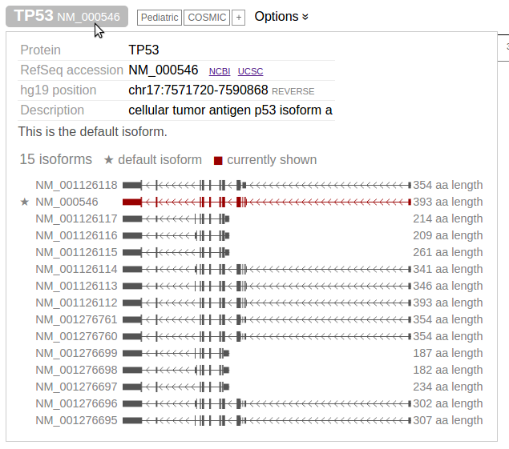
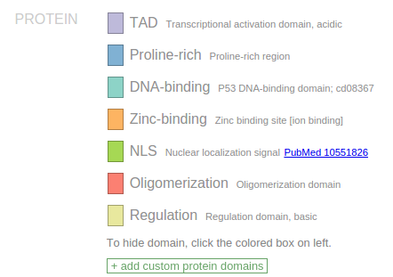
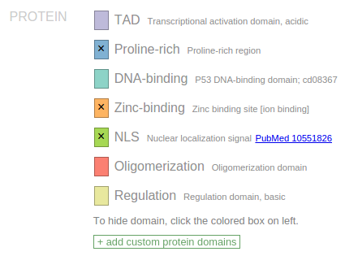
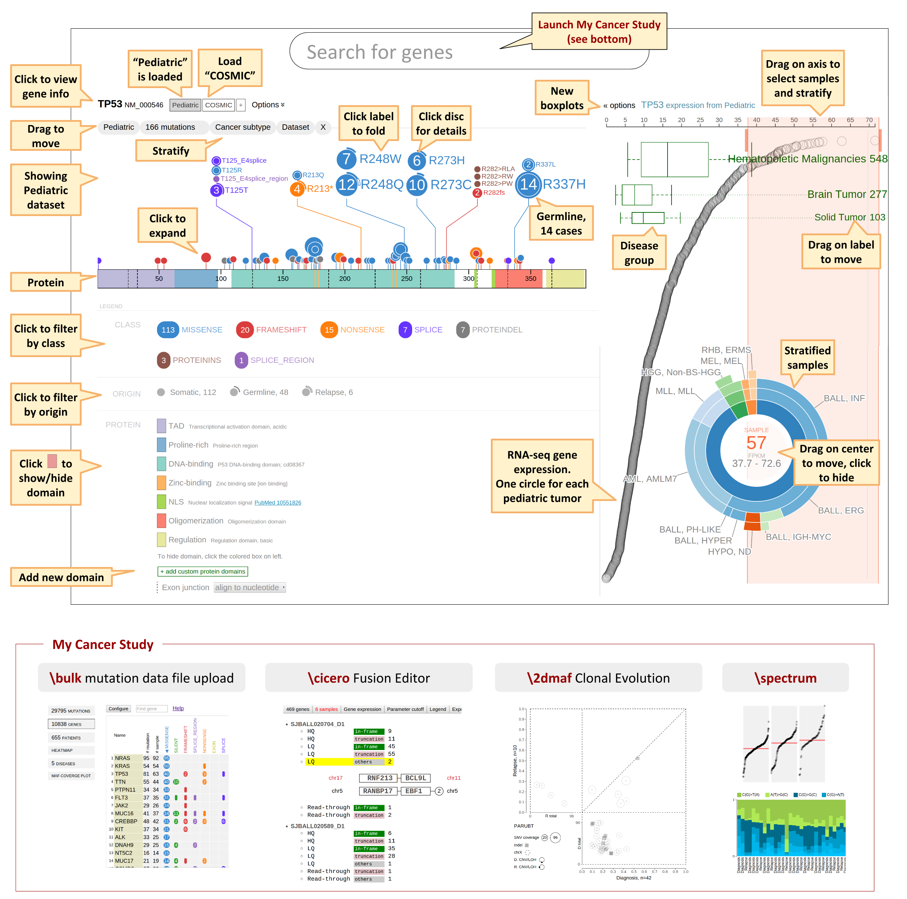

Use the search box on the top to find a protein by HUGO gene symbol, for
example "TP53".

The TP53 protein is rendered as a color-banded ruler, with the numerical
axis the representing number of amino acid residues from N-terminus to
C-terminus. This example shows the protein translated from the preferred
isoform of *TP53* gene (NM_000546), shown on the top left. Click the
gene symbol to view all isoforms for *TP53:*

To view a different protein isoform, either click on the diagram of the
isoform in above panel, or search by the isoform's RefSeq accession
number instead of gene symbol.

### **Protein domain**

The source of protein domain annotation is primarily the NCBI CDD
database, which has been supplemented by in-house curation efforts. In
ProteinPaint, domains are represented by color bands, with varying
colors indicating different types of domains. The list of domain types
is shown in the legend according to their order of appearance on the
protein. For manually curated domains, a PubMed link may be available to
reference the source publication.

Hovering the cursor over the protein will display a tooltip showing any
domains under the cursor (in some cases there can be more than one):

As a convenience, ProteinPaint offers an option to hide selected
domains. To hide a domain type, click on one of the colored boxes in the
legend to hide all occurrences of the selected type of domain from
display. An "x" sign will appear inside the box to indicate a domain has
been hidden. Following example shows TP53 protein with three types of
domain hidden:

Hidden domains will be excluded from screenshots. Click the box marked by "X" to toggle the domain visible again.

### Exon junction

When hovering the cursor over the protein, the tooltip indicates the
amino acid residue under the cursor, and the associated exon number:

Dashed lines represent exon junctions. The following example shows an
exon junction is overlaps with Alanine 307, which is marked by exon
numbers 8 and 9:

To show additional details about A307, click on this position and
ProteinPaint will zoom in to show that the exon junction falls inside
codon A307, between the first and second nucleotides. The codon
nucleotides are shown in the top row, and amino acid residues are shown
in the middle. Alternating background shades help distinguish adjacent
codons. During zoom-in, the genomic coordinates of nucleotides will also
be shown in tooltip:

The exon junctions are aligned to nucleotide positions by default. This
alignment can be configured or turned to hidden using a drop-down menu
in the legend:

For example, by choosing the option "align to amino acid", the exon
junction inside A307 will be aligned to the center of the A307 residue:

After zooming-in, clicking on either side of the protein will scroll
left or right. To zoom out and view entire protein again, click the
"Show all" button on the top:

## Summary

